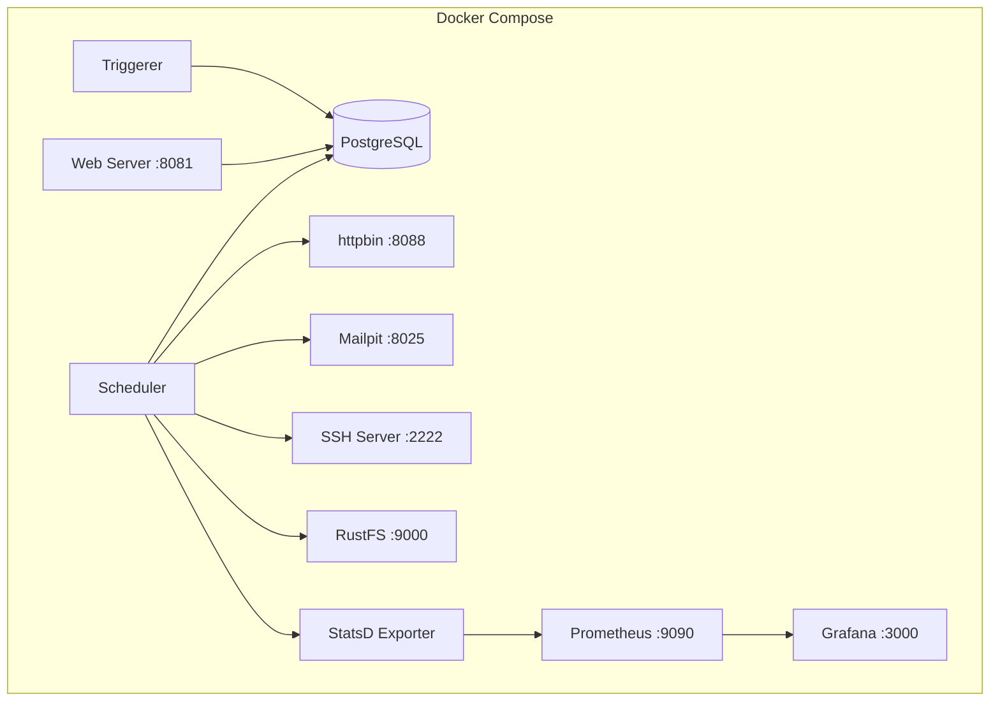
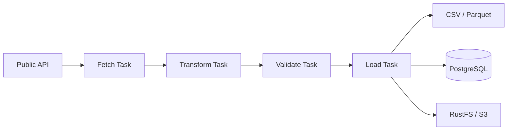
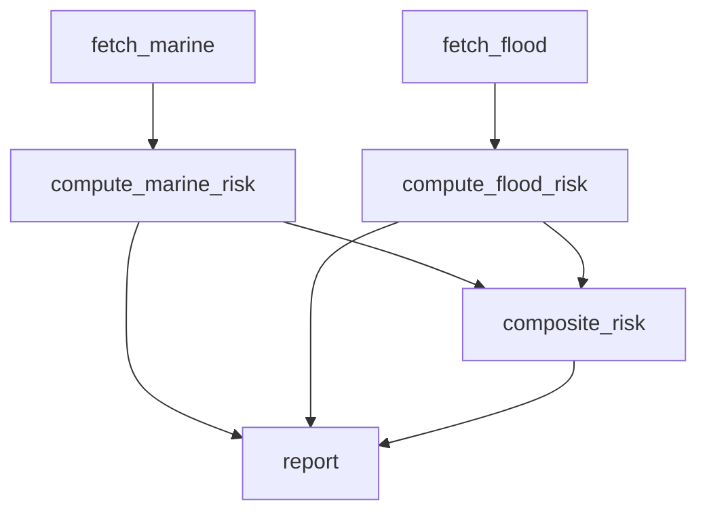
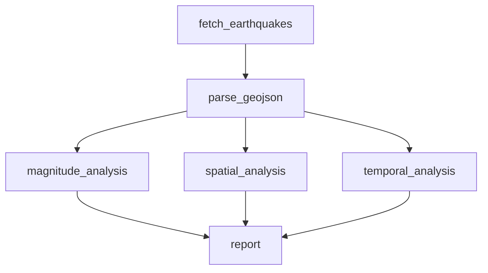
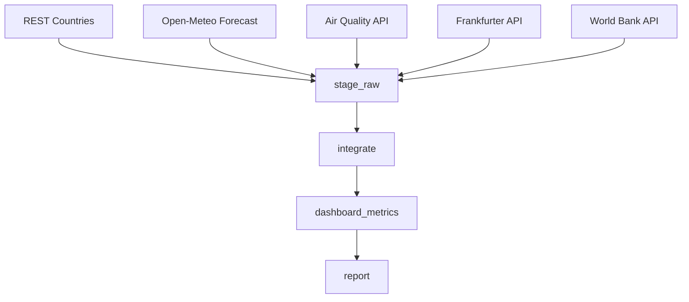
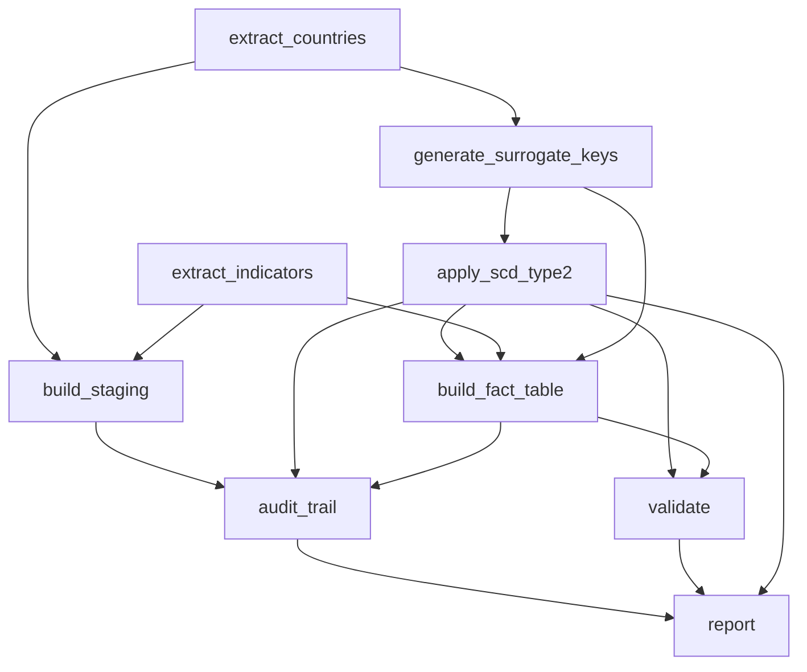
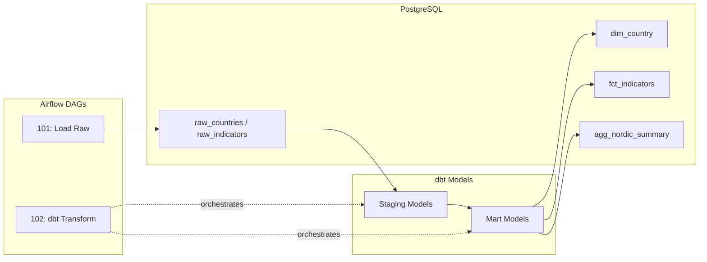
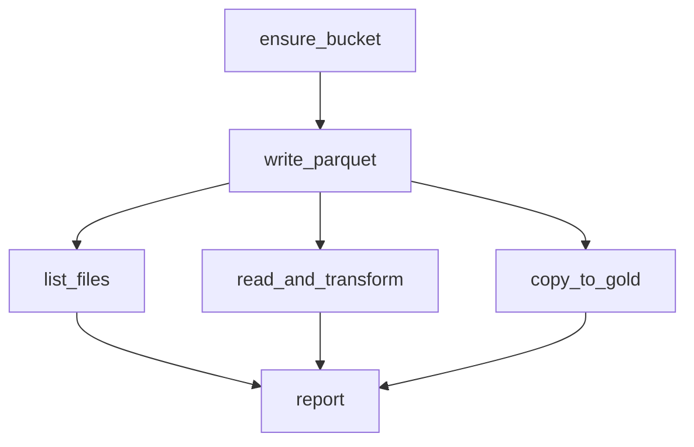
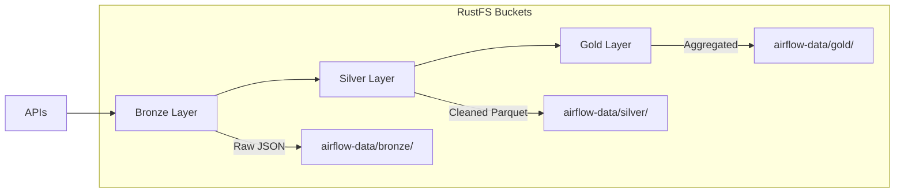
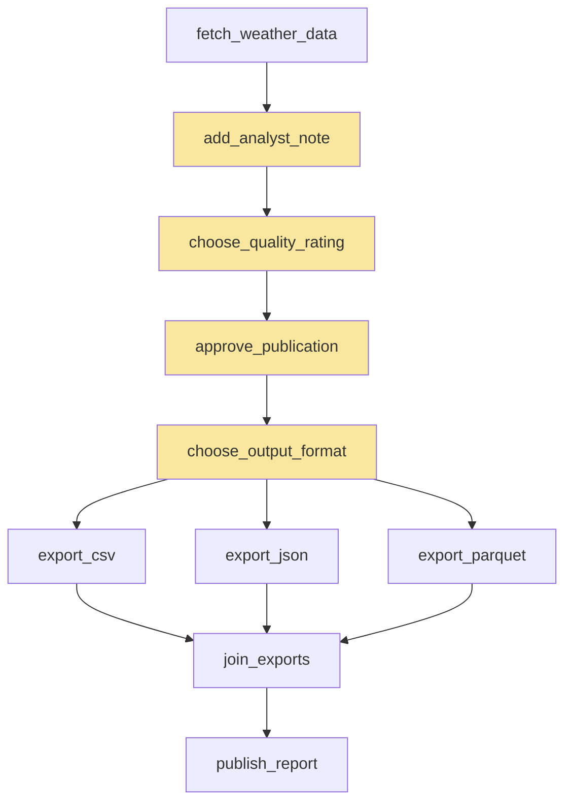

# Reference

## Executors: How Tasks Actually Run

You do not need to understand executors to use this project -- `LocalExecutor` is
configured automatically. This section is useful if you are deploying Airflow in
production and need to choose how to scale.

### LocalExecutor

- Tasks run as separate processes on the same machine as the scheduler
- Good for development and small-to-medium workloads
- Used in this project's `compose.yml`

### CeleryExecutor

- Tasks dispatched to a pool of Celery workers (can span multiple machines)
- Requires a message broker (Redis/RabbitMQ)
- Good for medium-to-large workloads with horizontal scaling

### KubernetesExecutor

- Each task runs in its own Kubernetes pod
- Maximum isolation: each task gets its own container, resources, and dependencies
- Good for heterogeneous workloads with varying resource requirements
- Tasks can use different Docker images

### Comparison

| Feature | LocalExecutor | CeleryExecutor | KubernetesExecutor |
|---------|--------------|----------------|-------------------|
| Setup complexity | Low | Medium | High |
| Scalability | Single machine | Multi-machine | Cluster-wide |
| Isolation | Process-level | Process-level | Container-level |
| Resource efficiency | High | Medium | Variable |
| Cold start | None | None | Pod spin-up time |
| Best for | Dev/small prod | Medium prod | Large/varied prod |

---

## Airflow 3.x Migration Notes

Airflow 3.0 (April 2025) introduced significant breaking changes from 2.x:

| 2.x | 3.x |
|-----|-----|
| `from airflow import DAG` | `from airflow.sdk import DAG` |
| `from airflow.operators.bash import BashOperator` | `from airflow.providers.standard.operators.bash import BashOperator` |
| `from airflow.operators.python import PythonOperator` | `from airflow.providers.standard.operators.python import PythonOperator` |
| `Dataset` | `Asset` |
| `execution_date` in context | `logical_date` in context |
| `schedule_interval="@daily"` | `schedule="@daily"` |
| SubDAGs | TaskGroups (SubDAGs removed) |

---

## Architecture Diagrams

### Project Infrastructure



### Data Flow Pattern



### DAG 84: Marine + Flood Risk (Fan-out / Fan-in)



### DAG 91: Earthquake Analysis (Parallel Analysis Branches)



### DAG 98: Multi-API Dashboard (6-Source Fan-In)



### DAG 100: Capstone ETL (Diamond Dependencies)



### dbt Integration Flow



### DAG 105: ObjectStoragePath Pipeline



### Data Lake Layers (RustFS)



### DAG 106: HITL Weather Quality Review



---

## Infrastructure

### How `make run` Works

Behind the scenes, `make run` does the following:

1. **Starts Docker containers** -- PostgreSQL (database), Airflow (scheduler + web server +
   triggerer), plus helper services (mock HTTP server, mail catcher, SSH server)
2. **Initializes Airflow** -- creates the database tables, the admin user, and default
   connections
3. **Runs all 107 DAGs** -- executes each one in order using `airflow dags test`
4. **Shows logs** -- tails the scheduler logs so you can watch what is happening
5. **Cleans up on Ctrl+C** -- stops and removes all containers

```bash
make run            # Does everything above
make stop           # Force-stop services if something goes wrong
```

### Running a Single DAG

If you want to run just one DAG (while services are running from `make run`):

```bash
# The pattern is: docker compose exec airflow-scheduler airflow dags test <dag_id> <date>
docker compose exec airflow-scheduler airflow dags test 01_hello_world 2025-01-01
```

### Testing Without Docker

Unit tests do not need Docker -- they use a lightweight in-memory database:

```bash
make test           # pytest with SQLite, no Docker needed
```

---

## Links

- [Apache Airflow documentation](https://airflow.apache.org/docs/)
- [Airflow on GitHub](https://github.com/apache/airflow)
- [Airflow 3.0 release notes](https://airflow.apache.org/docs/apache-airflow/stable/release_notes.html)
- [Airflow providers index](https://airflow.apache.org/docs/apache-airflow-providers/)
- [Docker provider](https://airflow.apache.org/docs/apache-airflow-providers-docker/stable/index.html)
